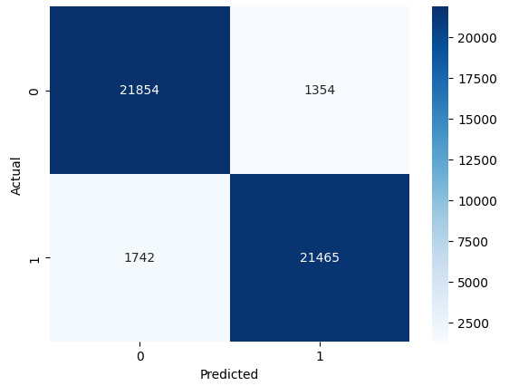
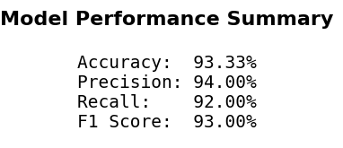

# 🧠 Suicide Detection using Machine Learning & NLP

Mental health is one of the biggest challenges today. **Can AI help detect suicidal tendencies early and save lives?**  

This project uses **Natural Language Processing (NLP)** and **Machine Learning** to classify text posts as **suicidal** or **non-suicidal**.

---

## ✅ Project Overview
- **Goal:** Detect suicidal intent in text data.
- **Dataset:** Suicide_Detection.csv
- **Approach:**
  - Text Preprocessing: Stopword removal, lemmatization
  - Feature Extraction: TF-IDF with unigrams & bigrams
  - Model: Logistic Regression with class balancing
- **Evaluation Metrics:** Accuracy, Precision, Recall, F1 Score

---

## 📊 Model Performance
| Metric      | Score  |
|------------|--------|
| Accuracy   | 93.33% |
| Precision  | 94.00% |
| Recall     | 92.00% |
| F1 Score   | 93.00% |

---

### 🔍 Confusion Matrix


### 📋 Performance Summary


---

## 🚀 How to Run

```bash
# Clone the repo
git clone https://github.com/yourusername/Suicide-Detection-ML-Project.git

# Install dependencies
pip install -r requirements.txt

# Run Jupyter Notebook
jupyter notebook suicide_detection.ipynb
